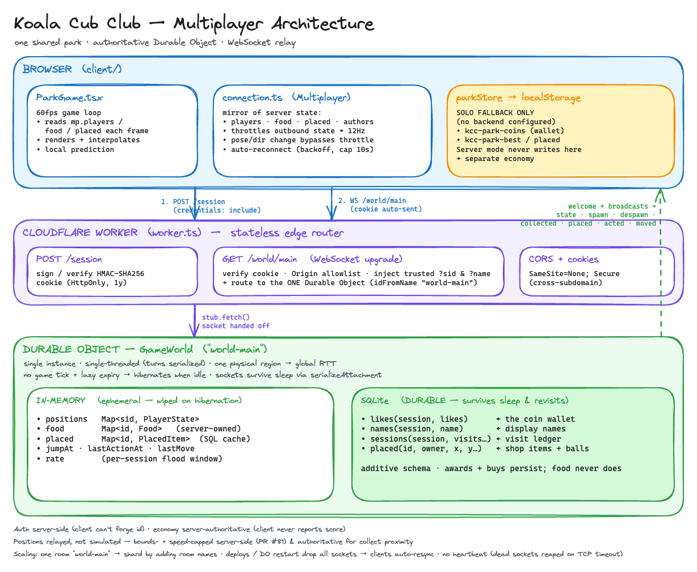
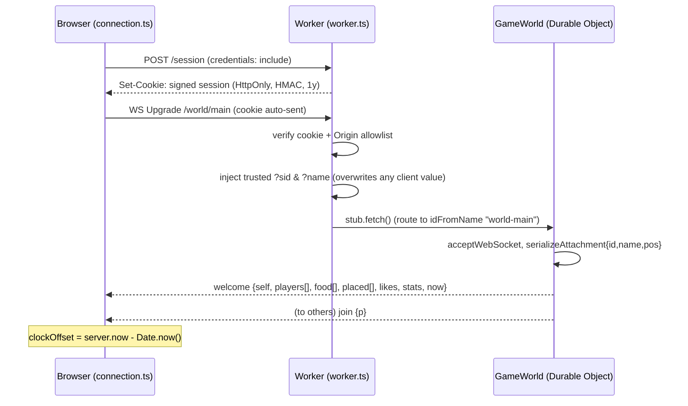

# Multiplayer

How Koala Cub Club's shared park works end to end: one authoritative Cloudflare
Durable Object, a stateless Worker in front of it, and a thin browser client that
mirrors whatever the server broadcasts.

> The diagram below is an Excalidraw PNG with the scene **embedded** — drag it
> onto [excalidraw.com](https://excalidraw.com) to edit it, then re-export with
> "Embed scene" on.



## Components

| Layer          | File                                   | Role                                                                                                                                                  |
| -------------- | -------------------------------------- | ----------------------------------------------------------------------------------------------------------------------------------------------------- |
| Client         | `client/src/components/ParkGame.tsx`   | 60fps canvas game loop; reads the multiplayer mirror each frame, renders, interpolates remote players, predicts locally                               |
| Client         | `client/src/multiplayer/connection.ts` | Owns the WebSocket + session cookie; keeps `players`/`food`/`placed`/`authors` Maps that mirror the server; throttles outbound state; auto-reconnects |
| Client         | `client/src/game/parkStore.ts`         | Wallet/placed store. In **solo** mode it uses `localStorage`; in **server** mode it just mirrors the server and never writes local storage            |
| Worker         | `server/src/worker.ts`                 | Stateless edge router: mints/verifies the session cookie, authenticates the WS upgrade, routes to the one Durable Object                              |
| Worker         | `server/src/session.ts`                | Anonymous identity: random id + HMAC-SHA256 signed cookie                                                                                             |
| Durable Object | `server/src/GameWorld.ts`              | The single authoritative park: presence, collectibles, economy, placed items                                                                          |
| Shared         | `shared/protocol.ts`                   | Wire types, tuning constants, and the `sanitize*` validators used by **both** sides                                                                   |

The mental model: **the Durable Object is the single source of truth.** The client
holds only a _mirror_ of what the DO broadcasts. Solo mode (`localStorage`) is a
pure fallback used when no Worker is configured for the build.

## Connection handshake



Auth is fully server-side: the Worker overwrites `sid`/`name` from the verified
cookie before the DO ever sees them, so a client can't smuggle a fake identity.

## Wire protocol

Defined in `shared/protocol.ts`. Keys are short because `state` travels on every
position update.

**Client → Server:** `state` · `collect` · `buy` · `setName` · `action` · `push` · `rest`

**Server → Client:** `welcome` · `join` · `leave` · `state` · `spawn` · `despawn` ·
`foods` · `collected` · `placed` · `unplaced` · `wallet` · `buyfail` · `renamed` ·
`stats` · `acted` · `pushed` · `moved`

Every inbound message runs through a `sanitize*` validator server-side — the wire
is never trusted.

## Per-feature flows

### Presence (high frequency, ephemeral)

Client sends `state` throttled to `CLIENT_SEND_HZ` (12Hz), but a pose/dir/interacting
change is sent **immediately** (bypassing the throttle) so a sit/turn/sleep shows up
without waiting for the next tick. The DO clamps to world bounds, stores the position
in memory, persists it on the socket attachment (so it survives hibernation), and
relays `{state, id, s}` to everyone else. Remote koalas are interpolated client-side
(`rx/ry` eased toward the authoritative `x/y`). Leg/tail/idle-bob animation is derived
locally from a shared frame clock — never sent.

Positions are **relayed, not simulated** — the server never integrates or reconciles
movement. But they're not free-form: the DO clamps to world bounds and, as of PR #81,
**speed-clamps** each step, and it treats its stored position as **authoritative for
collect proximity**. So a position is a client-driven value the server bounds and
trusts for the economy — not a purely cosmetic one (see
[Known gaps](#known-gaps--future-hardening)).

### Food (server-authoritative, in-memory, lazy)

There is **no game tick**. `maybeSpawn()` runs on join and on _every_ inbound message,
so player traffic drives spawns and expiry:

- Cap `= ceil(players / 2)` (`foodCap`), one shared `FOOD_SPAWN_COOLDOWN_MS` (4s) gate.
- Each spawn rolls `AIR_SPAWN_SHARE` (⅓) to be airborne; an `AIR_PITY_MS` (12s) timer
  forces airborne if it's been absent too long.
- TTL: `FOOD_TTL_MS` 30s ground / `AIR_FOOD_TTL_MS` 20s airborne.

Collection is validated on `collect`:

1. food exists (a double-collect race hits `!f` → no-op, because `food.delete` happens
   **before** awarding and the DO is single-threaded per turn — an atomic claim);
2. not past TTL;
3. airborne food requires a **live jump window** (`jumpAt` within `JUMP_DURATION_MS`);
4. proximity checked against the **server's** stored position, within `COLLECT_RADIUS`
   (0.85) / `AIR_COLLECT_RADIUS` (0.95).

On success it calls `addLikes()` (the one durable write), then broadcasts `{despawn}`
plus `{collected, by, points, likes}`. Airborne food is worth `AIR_POINTS_MULT` (2×).

### Shop / placed items (durable, shared)

`buy` → server checks overlap + affordability, spends via `addLikes(-price)`, `INSERT`s
the item (persist first, then mirror in memory), broadcasts `{placed}` and sends
`{wallet}` to the buyer. Items expire after `PLACED_TTL_MS` (7 days); `sweepPlaced()`
(traffic-driven) `DELETE`s them and broadcasts `{unplaced}`. The default balls are
seeded as **permanent** items (`expiresAt = PLACED_PERMANENT`).

### Balls (distributed simulation, one persist point)

`push` broadcasts a launch velocity (clamped to `MAX_BALL_SPEED`); every client runs
the _same_ integrator. Only `rest` persists — the DO rounds to a whole tile, writes
SQLite once, and broadcasts the authoritative `{moved}` so everyone snaps to the stored
tile. Any divergence self-heals on `moved`.

### Abilities

`action` → per-ability cooldown check (`ABILITY_COOLDOWNS_MS`) → broadcast `{acted}` so
peers animate. `jump` additionally opens that session's airborne-collect window.

## Persistence model

| Kind                                    | Where           | Survives hibernation / offline?                                                                |
| --------------------------------------- | --------------- | ---------------------------------------------------------------------------------------------- |
| positions                               | in-memory `Map` | No — repopulated from attachments / spawn                                                      |
| food                                    | in-memory `Map` | No — refills on next traffic                                                                   |
| jumpAt / lastActionAt / lastMove / rate | in-memory `Map` | No — `lastMove` reset on wake is intentional (see [Known gaps](#known-gaps--future-hardening)) |
| placed (cache)                          | in-memory `Map` | Rehydrated from SQLite                                                                         |
| **likes** (wallet)                      | **SQLite**      | Yes                                                                                            |
| **names**                               | **SQLite**      | Yes                                                                                            |
| **sessions** (visit ledger)             | **SQLite**      | Yes                                                                                            |
| **placed** (items + balls)              | **SQLite**      | Yes                                                                                            |

Food itself is never persisted — only the _likes_ it awards are. The session cookie
has a 1-year `Max-Age`, so a returning player is the same session id and gets their
wallet + items back.

## Going offline

A socket close/error fires `webSocketClose`/`webSocketError` → `dropped(ws)`:

```
socket dies
  └▶ dropped(ws)
       stillHere? = any OTHER socket with the same session id   ← second-tab guard
       if stillHere → do nothing (you're still present from your other tab)
       else:
         positions / rate / jumpAt / lastActionAt (id::*) deleted
         broadcast {leave, id}
```

The **client** reacts to its own `close`: clears its mirror Maps, and
`scheduleReconnect()` with exponential backoff capped at 10s. On reconnect, `welcome`
is a **full resync** (it replaces the client's Maps and fires `onResync()` to drop any
stale local ball simulation). Durable state (wallet, items, name, stats) is all waiting
in SQLite.

## Hibernation

Because the DO runs **no game loop**, it sleeps when the park is empty (cheap).
WebSockets stay connected through sleep. On wake:

- Presence rehydrates from each socket's `serializeAttachment` (players don't snap back
  to spawn).
- `placed` reloads from SQLite; likes/names/sessions were never lost.
- In-memory `food` is gone, so the DO broadcasts a `foods` resync so clients drop stale
  food; it refills on the next player traffic.

## Anti-cheat

Layered, and explicitly "best-effort for a cozy game."

1. **Identity can't be forged** (`session.ts` + `worker.ts`). 128-bit random id, signed
   HMAC-SHA256, constant-time compare. Cookie is `HttpOnly`; the WS upgrade enforces an
   **Origin allowlist**; the Worker **overwrites** `sid`/`name` with verified values
   before forwarding to the DO.
2. **Flood control** (`allow()` + `MAX_INBOUND_MSGS_PER_SEC` = 25). Sliding 1s window
   keyed by **session id, not socket**, so extra tabs can't multiply the budget. Excess
   is silently dropped.
3. **Never trust the wire** — every message is sanitized (`sanitizeState` clamps to
   bounds, `sanitizeBuy` checks catalog + footprint, `sanitizePush` clamps velocity,
   `sanitizeName` allowlists characters, etc.).
4. **Server-authoritative economy** — the client never reports points or score; it only
   asks to collect a food id, and the server owns the table, validates proximity against
   _its own_ stored position, and claims atomically.
5. **Server-enforced cooldowns** per `(session, ability)`, independent of the flood
   budget; ball rest is re-clamped/rounded before its single SQLite write.

## Solo vs multiplayer

`MULTIPLAYER_ENABLED` is simply "are the `VITE_GAME_HTTP_URL` / `VITE_GAME_WS_URL`
env vars set." They are **two separate economies**: solo coins live in `localStorage`
(`kcc-park-coins`); server mode runs `parkStore` in a server-fed mode that never touches
local storage. There is no migration between them — flipping a build from solo to a
deployed backend makes players' solo savings appear to vanish.

## Ops / config

- One Worker (`koala-game`) on `game.koalacub.club`; DO migration `v1 new_sqlite_classes`
  (`server/wrangler.jsonc`).
- Frontend `koalacub.club` and backend `game.koalacub.club` are different subdomains, so
  the cookie is `SameSite=None; Secure` in prod and CORS echoes the specific origin with
  credentials. If `ALLOWED_ORIGINS` or the cookie flags drift, the WS upgrade silently
  401s and everyone falls back to solo.
- `SESSION_SECRET` from `.dev.vars` locally / a Worker secret in prod. Rotating it
  invalidates every cookie (everyone becomes a new session → new wallet).

## Known gaps / future hardening

- **Movement speed** was historically unvalidated — only bounds were. Because the
  collect proximity check compares against the position the client itself reported, a
  cheater could "teleport" (within bounds) next to a food via a `state` message and then
  collect it. Being addressed in PR #81 (`feat/anticheat-speed`): a per-session
  `lastMove` map + `clampToSpeed()` cap each `state` step to `MOVE_SPEED_TILES_PER_MS ×
dt × slack`, plus a one-off `DASH_TILES` allowance during a live dash window. It
  **clamps** (never rejects) so honest laggy players don't rubber-band. Note the
  interaction with hibernation: `lastMove` is _not_ rehydrated on wake — a missing entry
  (first update / respawn / hibernation wake) resets the baseline, so the first
  post-wake `state` is accepted unclamped and clamping resumes from the next one. That
  mirrors why `positions` is restored from attachments: clamp what's cheatable, but
  never punish honest clients.

- **Protocol version isn't enforced.** `PROTOCOL_VERSION` is written into the socket
  attachment but never compared, so a breaking wire change has no handshake guard yet.

- **Rate-limit drops are silent.** `state` self-recovers next frame, but a dropped
  `collect`/`buy` just fails quietly (collect is debounced per id; buy has no retry).

- **Identity/wallet/ledger rows are never pruned** — one row per session ever, forever,
  in the single DO's SQLite. Placed items are TTL-reaped; these aren't.

- **Single global room.** Everyone routes to `idFromName("world-main")`: one DO instance,
  one SQLite, one single-threaded turn loop, O(players) broadcasts. Sharding would mean
  more room names (`worker.ts` has a single `ROOM` constant) — but then presence/economy
  stop being global. This is the one architectural fork worth deciding deliberately.

- **No connection heartbeat.** The DO doesn't use `setWebSocketAutoResponse` or any
  server-side ping. A silently-dead connection (network vanished without a clean close)
  is only reaped when the edge's TCP timeout fires `webSocketClose`, so a disappeared
  player can linger as a "ghost" in everyone else's roster until then.

- **Multi-tab broadcast quirk.** `broadcast(msg, exceptId)` excludes by **session id**,
  not socket. Two tabs share one session, so your own `state`/`acted`/`pushed` are
  withheld from _both_ your sockets — the two tabs won't sync to each other (each renders
  its own local cat). Harmless, but surprising when debugging with two tabs.

- **Balls are semi-trusted.** `push` writes the client-reported position straight to
  memory (bounds-clamped only) and relays it; only `rest` persists a rounded tile. A
  hostile client could relocate a ball to any in-bounds tile via `push` — cosmetic, and
  it self-heals on the next `rest`. Velocity is clamped (`MAX_BALL_SPEED`); position is
  not speed-checked the way player movement is.

- **Names are charset-sanitized, not moderated.** `sanitizeName` allows Unicode
  letters/numbers + a little punctuation and caps length, but there's no profanity/abuse
  filter — and names are visible to everyone and attached to placed items.

- **Schema is additive-only.** Tables use `CREATE TABLE IF NOT EXISTS`; there's no
  migration framework. Adding a column later means a manual `ALTER`/new-table dance — the
  wrangler `migrations` block only governs the DO _class_, not the table schema.

## Operational notes

- **Single region → global RTT.** A Durable Object lives in one physical location, so
  every player worldwide connects to that one point; far-away players see higher latency.
  There's no multi-region replication. The upside of "single instance" is that it's
  **single-threaded** — all mutations are serialized, which is exactly why the atomic
  food claim (`food.delete` before award) is race-free.

- **Deploys are a brief blip for everyone.** Shipping new Worker/DO code evicts the
  running instance and drops all WebSockets; clients reconnect (deterministic backoff,
  no jitter → lockstep waves) and get a fresh `welcome` resync. Durable state survives,
  so it self-heals.

- **Identity is anonymous and device-local.** A per-browser signed cookie — no account,
  no cross-device sync. Clearing cookies (or rotating `SESSION_SECRET`) yields a new
  session and a fresh wallet.

- **Tests poke DO internals.** `server/test/world.test.ts` drives the DO via
  `runInDurableObject` (e.g. the speed-cap tests raise `moveSpeed` in-place for
  movement-heavy setup); `client/src/multiplayer/connection.test.ts` covers the client.
  Follow that pattern when adding server behavior.
