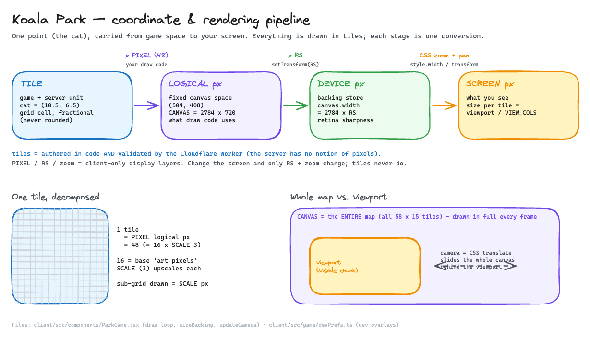

# Rendering & the coordinate pipeline

How a position in the game becomes pixels on your screen — and the **developer
overlays** that let you see it happen live. This is the deep dive behind the
one-paragraph "Coordinate system" note in [game.md](./game.md); read that first
for the feature overview.

> Drag the image below onto [excalidraw.com](https://excalidraw.com) to edit, then
> re-export as PNG with **"Embed scene"** on. (Convention: `.excalidraw.png` = the
> scene is embedded and editable; the `.excalidraw` source is committed alongside.)



## Two units, one exchange rate

The single most common confusion is the constant **`PIXEL`**. It does **not** mean
"one pixel" — it means **how many pixels make up one tile**. Read it as
`PIXELS_PER_TILE`.

- **tile** — the unit the game _thinks_ in. Positions, distances, map size,
  collisions, and the multiplayer wire protocol are all in tiles. Tile coordinates
  are **floats** (the cat at `10.5` is halfway into a cell — never rounded).
- **`PIXEL` = `16 * SCALE` = 48** — the exchange rate: multiply a tile by `PIXEL`
  to get **logical pixels** at draw time.
- **`16`** is the pixel-art authoring unit; **`SCALE` (3)** upscales each to 3
  logical pixels. So one tile = 16 base pixels × 3 = 48 logical pixels.

```
tile 10.5  ── × PIXEL (48) ──▶  logical 504
```

That single `× PIXEL` is the entire bridge between "game space" and "draw space."

## The pipeline: tile → logical → device → screen

A position passes through three conversions before you see it. See the diagram
above; in code:

| Stage          | Value (example)       | Who converts it                                   | Where                          |
| -------------- | --------------------- | ------------------------------------------------- | ------------------------------ |
| **tile**       | `10.5, 6.5`           | — (game logic)                                    | everywhere                     |
| **logical px** | `504, 408`            | your draw code: `× PIXEL` (+ `WORLD_OFFSET` on y) | `ParkGame.tsx` draw calls      |
| **device px**  | `× RS` (retina)       | the canvas, via `setTransform(RS)`                | `ParkGame.tsx` frame top       |
| **screen px**  | `+ zoom + camera pan` | CSS (`style.width`, `transform`)                  | `measure()` / `updateCamera()` |

- **tile → logical** is the only manual step — a multiply plus the `translate` that
  positions a sprite's origin.
- **logical → device** is applied invisibly by `ctx.setTransform(RS,0,0,RS,0,0)` at
  the top of every frame, so all draw code stays in logical units.
- **device → screen** is pure CSS: the whole canvas element is scaled to cover the
  viewport and slid by the camera transform. **Draw code never subtracts a camera
  offset** — the world is always drawn at fixed logical coordinates.

`logical == device` only when `RS == 1` (DPI 1 **and** no zoom stretch); it is not
guaranteed by DPI 1 alone.

## Three "canvas widths" + the viewport

"Canvas width" is ambiguous — there are three, and **all three hold the entire
map.** They differ in units, not extent:

| Width                            | Value                             | Fixed?                         |
| -------------------------------- | --------------------------------- | ------------------------------ |
| **logical** `CANVAS_WIDTH`       | `MAP_COLS × PIXEL` (2784)         | fixed (derived from constants) |
| **backing** `canvas.width`       | `CANVAS_WIDTH × RS`               | per-device                     |
| **display** `canvas.style.width` | `viewport × MAP_COLS / VIEW_COLS` | per-viewport                   |

The **visible chunk is a fourth thing — the viewport** — which is _smaller_ than
the display width. The canvas element is larger than the window; the **camera** is
just a CSS `translate` that slides the whole (map-sized) canvas behind the
viewport. This is why the game **draws the entire world every frame** — the camera
is a slide, not a sub-region redraw.

Mental model: **the world has a fixed size; the screen adapts around it.** To make
the game look bigger (zoom in), change **`VIEW_COLS`** (fewer visible columns →
bigger tiles on screen) — _not_ `CANVAS_WIDTH`.

## `sizeBacking()` — resolution independence

Device pixels are quarantined to one function (`ParkGame.tsx`, `sizeBacking()`):

```js
const dpr = window.devicePixelRatio || 1
RS = Math.max(1, Math.min(2, (cssW * dpr) / CANVAS_WIDTH))
canvas.width = Math.round(CANVAS_WIDTH * RS) // backing store, in DEVICE pixels
```

`RS` is a **1–2× quality multiplier**: it sizes the real backing store so the
picture is crisp on retina (and caps at 2× to avoid wasting GPU on 3× screens).
Everything else keeps drawing in logical units; `setTransform(RS)` applies the
multiply. Change screens → only `RS` changes → no draw code changes. That is the
whole point of working in `PIXEL`/tile units rather than device pixels.

## Why tiles, not pixels?

Even though `PIXEL` rarely changes, positions are stored in **tiles** because:

1. **`SCALE` is a knob.** Bump it and `PIXEL` changes; tile positions and all
   `*_TILES` constants stay correct, while logical-pixel positions would all break.
2. **The server only speaks tiles.** The Cloudflare Worker validates positions and
   collisions in tiles (`WORLD.cols`, `COLLECT_RADIUS = 0.85`) and has no notion of
   `PIXEL` — a client rendering detail. Tiles are the shared, render-agnostic unit.
3. **The game is grid-shaped.** Object placement, overlap checks, and food spawns
   are natural in cells; constants like `DASH_TILES = 3` stay readable.

Tiles are the **domain unit**; `PIXEL` is applied once, at the last moment, when
painting.

## Are we painting pixel by pixel? No.

Canvas 2D is a **shape API**. The scene is a continuous vector painting — gradients
(`createLinearGradient` for the sky), curved blobs (`quadraticCurveTo` in
`drawBlobPatch` for grass), circles (`arc`), rects, and `drawImage` blits (the
baked background). You issue a shape + a `fillStyle` + the current transform; the
browser's rasterizer decides which device pixels to color, **anti-aliases** edges
(`imageSmoothingEnabled = true`), and composites over what's already there.

Consequences worth knowing:

- **Painter's model + depth sort.** Draw back-to-front; `drawObjects` sorts by `y`
  so nearer things overlap farther ones (no z-buffer).
- **Nothing snaps to the tile grid.** The world is painted independent of tiles, so
  a single tile — or a single "base pixel" region — can span multiple colors. The
  _true_ atom is the **device pixel**, which is always one solid color; the game's
  "pixels" (`PIXEL`, base pixels) are multi-device-pixel _blocks_, hence the color
  variation. This game is **not** pixel-art despite the `16`/`SCALE` framing — those
  are a coordinate convention, not a quantized color grid.

## Walkthrough: `drawCat`

`drawCat` never computes a screen position. It:

1. Converts tile → logical once: `x = cat.x * PIXEL`.
2. Moves the origin to the cat's center: `ctx.translate(x + PIXEL*0.5, y + PIXEL*0.5 + bob - jumpPx)`,
   then `ctx.scale(flip, 1)` to face left/right. Animation (bob, hop) folds into the
   translate so the whole sprite moves as a unit.
3. Draws every body part as shapes in `s` (= `SCALE`) units around local `(0,0)` —
   e.g. the body is `ctx.ellipse(0, s*2, s*5, s*4, …)`, a 30×24-logical-px oval
   (~0.63 tile). Ears/tail are `moveTo`/`lineTo`/`quadraticCurveTo` paths.

The active transform stack (`setTransform(RS)` → `translate(0, WORLD_OFFSET)` →
the sprite's `translate`) then maps each local coordinate to a device pixel as a
matrix multiply. Move the cat to `10.5` and everything shifts smoothly; face left
and `scale(-1,1)` mirrors the same code.

## Developer overlays (`?dev`)

The overlays are X-ray glasses for everything above — they draw the grids and the
coordinate readout right on the canvas. Source: `client/src/game/devPrefs.ts`
(state) + the `draw*` helpers in `ParkGame.tsx` + the Dev button in
`BottomBar.tsx`.

**Unlocking:** add `?dev` to the URL. It's remembered (persisted to
`localStorage`), so the 🐛 Dev button (next to Settings) stays available on that
browser; the `dev` param is stripped from the address bar once applied. `?dev=0`
turns it off and force-resets every overlay flag (so nothing lingers on the
canvas). The button never renders for normal visitors.

**Toggles** (each persisted independently):

| Toggle          | What it draws                                                                      | Concept it exposes               |
| --------------- | ---------------------------------------------------------------------------------- | -------------------------------- |
| **Tile grid**   | one-cell grid over the park + highlights the cat's tile, with axis labels          | tiles as a coordinate grid       |
| **Pixel grid**  | the 16×16 base-pixel lattice **inside the cat's tile only** (a loupe)              | `1 tile = 16 base px × SCALE`    |
| **FPS counter** | smoothed FPS + a compact `zoom / PIXEL / RS` context line                          | frame rate, the render constants |
| **Coords**      | the same point in all four unit systems (`tile → logical → device → screen`), live | the full conversion pipeline     |

The **Pixel grid** is deliberately scoped to one tile: a full-map 16× lattice
would be ~928 lines and moiré into mush at this zoom. The **Coords** panel is the
most direct teaching tool — walk around and watch `× PIXEL` and `× RS` happen. Both
info panels are pinned to the viewport via the (otherwise unused) `hudShift` /
`hudShiftY` fields that `updateCamera` computes.

## Files

- `client/src/components/ParkGame.tsx` — the draw loop, `sizeBacking()`,
  `updateCamera()`, `drawCat`, and the `drawTileGrid` / `drawPixelGrid` /
  `drawDevHud` overlay helpers.
- `client/src/components/parkCamera.ts` — pure, unit-tested camera-pan math.
- `client/src/game/devPrefs.ts` — dev-mode gating + overlay flags.
- `client/src/components/BottomBar.tsx` — the Dev button + toggles.
